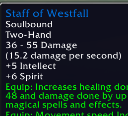

# Westfall Staff Equip

Click **Equip Staff** to equip Staff of Westfall in Elwynn Forest, Westfall, Redridge Mountains, or the Deadmines. The reminder hides when the staff is equipped, absent from your bags, or you leave those zones.

Type `/wse` for the same settings layout as Night Watch Torch:

- Enable switch and small X to dismiss the helper.
- Movable previews with separately saved button positions.
- Optional Hide button, off by default; 5-minute default hide timer.
- Post-combat delay, 10 seconds by default.
- Optional fade, off by default; 10-second default fade delay. Hover to reveal.
- Show again now and Reset positions.

Also available under Options > AddOns. Previews cannot equip the staff. Combat hides the buttons; casting, channeling, eating, and drinking temporarily suppress the reminder.

Commands: `/wse on`, `/wse off`, `/wse show` (clear hide timer), `/wse zones`, `/wse reset` (enable and clear timer).

One click equips the two-handed staff and remembers your main-hand and off-hand items. When you leave its zones, **Restore Weapons** appears. Click to restore one slot at a time; a weapon pair can need two clicks. Empty slots are remembered too, and clearing a slot needs a free normal bag slot. Missing or locked items stay remembered so you can try again once they are available. Your saved setup survives reloads and is separate for each character. The helper only remembers equipment when you equip the staff through its button. Zone matching uses English client zone names.

## Install

Copy this folder into `_classic_beta_/Interface/AddOns/WestfallStaffEquip`. Reload; restart the game if the new addon is not detected.

## References and validation

Item 2042 and zone list checked on 2026-09-27 against the client-data references at https://forever-codex.com/gear/biomes/ and https://forever-codex.com/gear/?item=2042.

Live checks still needed: preview dragging, a real equip click in a listed zone, hiding after equip and outside the listed zones, and combat suppression. Offline checks cannot prove in-game behavior.

This beta passed offline Lua 5.1 and simulated equipment checks. Real equip/restore clicks and rendering still need testing in the Forever client.

Adapted from Night Watch Torch by Videocat. Addon code is MIT licensed; see LICENSE. The supplied World of Warcraft tooltip image belongs to Blizzard Entertainment and is not covered by the code license. This is an unofficial addon.
